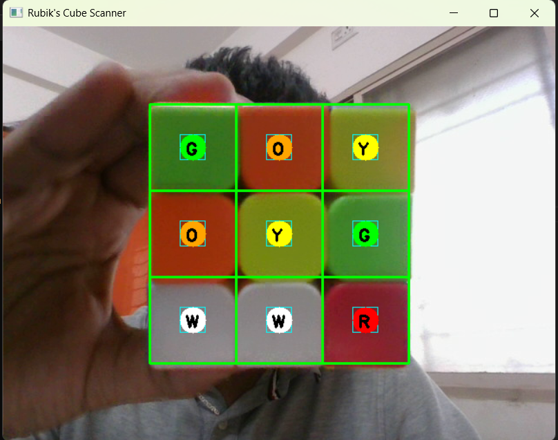
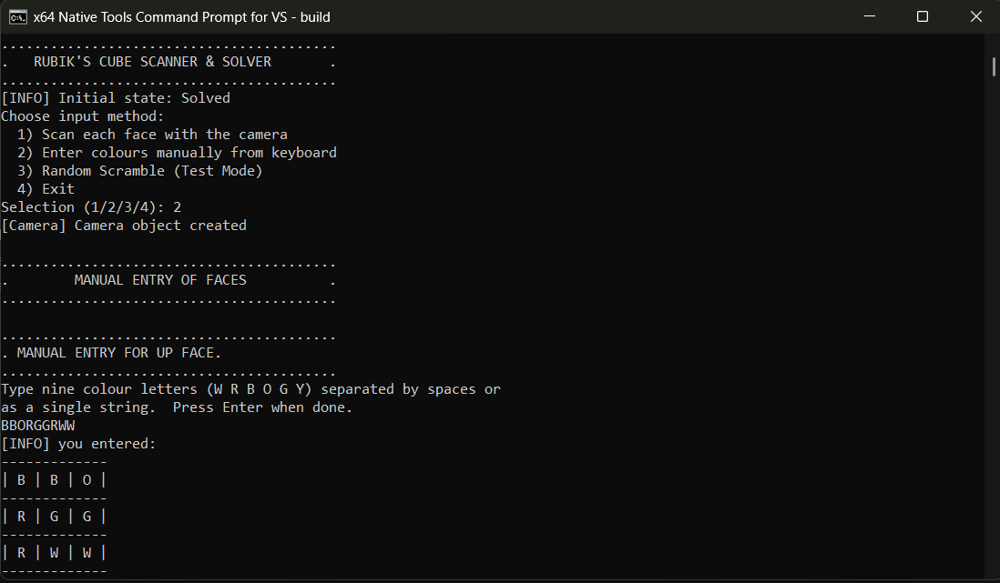
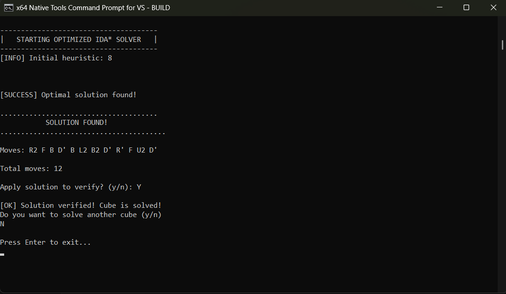

# 🧩 Rubik's Cube Scanner & Solver

A **C++ application** that scans a physical Rubik's Cube using a webcam, identifies the colors of all 54 stickers, and computes the **optimal solution** using an IDA\* search algorithm guided by Pattern Database heuristics.

---

## 📸 Screenshots

### Camera Scanner


### Manual Color Entry


### Solution Output


---

## ✨ Features

- **3 Input Modes:**
  - 📷 **Camera Scan** — Point webcam at each face to auto-detect colors and press space-bar to capture that face
  - ⌨️ **Manual Entry** — Type colors face by face
  - 🎲 **Random Scramble** — Generate a random scramble (up to 13 moves) for testing
- **Optimal Solver** — Finds the shortest possible solution using IDA\*
- **Pattern Database Heuristics** — Pre-computed lookup tables guide the search efficiently
- **Solution Verification** — Every solution is verified on a cube clone before being shown

---

## 🏗️ How It's Built

### Architecture

```
sarveshcube/
├── main.cpp                  # Entry point — input handling & solve flow
├── cube/
│   ├── Cube.h / Cube.cpp     # Core cube state, all 18 moves, isSolved()
├── solver/
│   ├── IDAStar.h / .cpp      # IDA* search + timeout logic
│   ├── PatternDatabase.h/.cpp# Corner PDB + 2x Edge PDB generation & lookup
├── vision/
│   ├── Camera.h / .cpp       # OpenCV webcam capture & frame display
│   ├── ColorDetector.h       # HSV-based color classification
├── databases/
│   ├── corner_pdb_v2.dat     # Pre-computed corner pattern database (~88M entries)
│   ├── edge_pdb1_v2.dat      # Edge PDB set 1 (~42M entries)
│   └── edge_pdb2_v2.dat      # Edge PDB set 2 (~42M entries)
└── build.bat                 # One-command build script
```

### Algorithm — IDA\* with Pattern Databases

The solver uses **Iterative Deepening A\*** (IDA\*), a memory-efficient search algorithm that finds the optimal (shortest) solution.

**Heuristic:** The admissible heuristic is the **maximum** of three Pattern Database lookups:

```
h(state) = max(CornerPDB(state), EdgePDB1(state), EdgePDB2(state))
```

| Database | Pieces Tracked | Size | Purpose |
|---|---|---|---|
| Corner PDB | All 8 corners | ~88M entries | Corner placement & orientation |
| Edge PDB 1 | 6 edges (UF/UL/UB/UR/FL/FR) | ~42M entries | Edge placement & orientation |
| Edge PDB 2 | 6 edges (DL/DR/BL/BR/DF/DB) | ~42M entries | Remaining edge placement |

**Search pruning:** The `canFollow[][]` table eliminates provably redundant move sequences (e.g., `U` followed by `U'`, or `U D` when `D U` is equivalent), cutting the effective branching factor from 18 to ~10.

**Timeout:** If the search exceeds 20 seconds (deep scrambles), the solver exits gracefully and advises using a ≤13 move scramble.

### Color Detection (Camera Mode)

Each face is captured via OpenCV. The center region of each of the 9 sticker positions is sampled and classified into one of 6 colors using **HSV thresholds**. The center sticker of each face is used as the ground-truth color for that face.

---

## ⚙️ Build & Run

### Prerequisites

- **Windows** with [Visual Studio](https://visualstudio.microsoft.com/) (any edition with C++ tools)
- **OpenCV 4.9.0** — Download from [opencv.org](https://opencv.org/releases/) and extract to `C:\opencv`

### Steps

1. Open **x64 Native Tools Command Prompt for VS** (search it in the Start Menu)

2. Navigate to the project folder:
   ```
   cd "C:\path\to\sarveshcube"
   ```

3. Build and run in one command:
   ```
   build
   ```

That's it. The `build.bat` script compiles all files with optimizations (`/O2`) and launches the program automatically on success.

> **First run:** The Pattern Databases are pre-generated and stored in `databases/`. If the `.dat` files are missing, they will be regenerated automatically (takes 3–5 minutes).

---

## 🎮 Usage

```
.........................................
.   RUBIK'S CUBE SCANNER & SOLVER
.........................................

Choose input method:
  1) Scan each face with the camera
  2) Enter colours manually from keyboard
  3) Random Scramble (Test Mode)
  4) Exit
```

- **Mode 1 (Camera):** Follow on-screen prompts to present each face (U, L, F, R, B, D) to the webcam
- **Mode 2 (Manual):** Enter 9 colors per face using initials: `W`hite, `R`ed, `G`reen, `O`range, `B`lue, `Y`ellow
- **Mode 3 (Random):** Enter a number between 1–13 for a random test scramble

After solving, you'll be shown the move sequence and can verify it was applied correctly.

---

## � Move Notation

The solver uses standard **Rubik's Cube Notation** (Singmaster notation). Each letter represents a face, and the suffix indicates direction:

| Move | Face | Direction |
|------|------|-----------|
| `U`  | **U**p    | Clockwise (when looking at that face) |
| `U'` | **U**p    | Counter-clockwise |
| `U2` | **U**p    | 180° (two quarter turns) |
| `D`  | **D**own  | Clockwise |
| `D'` | **D**own  | Counter-clockwise |
| `D2` | **D**own  | 180° |
| `L`  | **L**eft  | Clockwise |
| `L'` | **L**eft  | Counter-clockwise |
| `L2` | **L**eft  | 180° |
| `R`  | **R**ight | Clockwise |
| `R'` | **R**ight | Counter-clockwise |
| `R2` | **R**ight | 180° |
| `F`  | **F**ront | Clockwise |
| `F'` | **F**ront | Counter-clockwise |
| `F2` | **F**ront | 180° |
| `B`  | **B**ack  | Clockwise |
| `B'` | **B**ack  | Counter-clockwise |
| `B2` | **B**ack  | 180° |

> **Example solution:** `R U R' U' R' F R2 U' R' U' R U R' F'`
> Read left to right — apply each move in sequence to solve the cube.

---

## �🛠️ Tech Stack

| Component | Technology |
|---|---|
| Language | C++17 |
| Compiler | MSVC (`cl.exe`) via Visual Studio |
| Computer Vision | OpenCV 4.9.0 |
| Search Algorithm | IDA\* (Iterative Deepening A\*) |
| Heuristic | Additive Pattern Databases (3 PDBs) |
| Build | `build.bat` (MSVC command-line) |

---

## 📐 Design Decisions

**Why IDA\* over BFS/Dijkstra?**
BFS on the Rubik's Cube state space (~4.3 × 10¹⁹ states) is impossible — it would require terabytes of memory. IDA\* is memory-minimal (only stores the current path) and finds the optimal solution by iteratively increasing the depth bound.

**Why Pattern Databases over a simple heuristic?**
A naive "misplaced stickers" heuristic gives a very weak lower bound, causing IDA\* to explore billions of nodes. PDBs pre-compute exact distances for subsets of pieces, giving tight lower bounds that prune the search tree dramatically — reducing nodes explored by several orders of magnitude.

**Why 3 PDBs instead of 1?**
A single PDB covering all 20 pieces would require hundreds of GB. By splitting into 3 smaller PDBs (8 corners + 6+6 edges) and taking the max, we get a strong admissible heuristic that fits in ~172MB total.

---

## 📄 License

MIT License — free to use, modify, and distribute.
